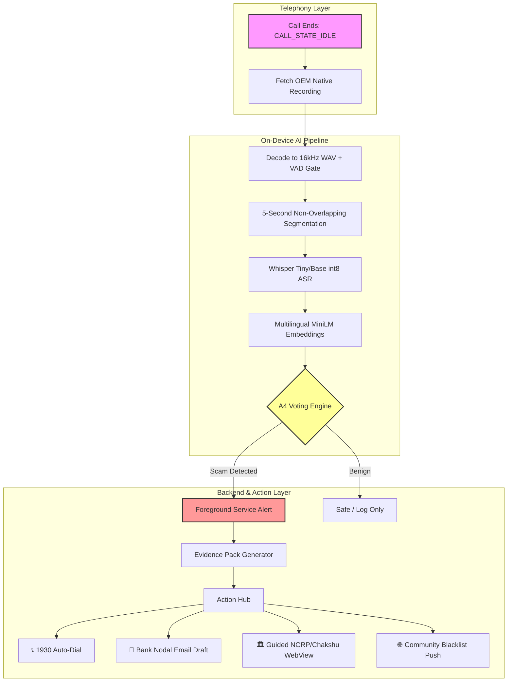

<div align="center">

# 🛡️ Rakshak Setu (रक्षक सेतु)
### On-Device Telecom Scam Interceptor & Golden-Hour Recovery Accelerator

**Built by Forge Labs | Smart India Hackathon (SIH) 2026**

[]()
[]()
[]()
[]()
[]()

*Truecaller reads the number. Telcos read metadata. **Rakshak Setu reads the manipulation.***

[Features](#-key-features) • [Architecture](#-system-architecture) • [AI Pipeline](#-the-ai-pipeline) • [Setup](#-getting-started) • [Research](#-research-foundation)

</div>

---

## 🚨 The Problem
In 2025, India lost **₹22,495 Crore** to cyber fraud, with **770 Crore** scam calls identified. Yet, **only ~6% of stolen money is ever recovered**. 
Why? Because victims miss the **"Golden Hour"**. Panic sets in, and the manual process of filing a police report on the NCRP portal takes **40+ minutes**, requires complex formatting, and demands evidence gathering that a panicked user cannot perform. 

## 💡 The Solution: Rakshak Setu
Rakshak Setu is a privacy-first, 100% on-device Android application that legally fetches the phone's native OEM call recording *after* a call ends. It uses lightweight Edge AI to transcribe and analyze the scam script in **Hindi/Hinglish**, alerts the user within **30 seconds to 1 minute**, auto-generates a government-compliant evidence pack, and guides the user through a **3-minute** reporting flow to the NCRP and Chakshu portals.

---

## ✨ Key Features

- 📱 **100% On-Device & Private:** Raw audio never leaves the phone. Zero cloud dependency for core detection. Fully DPDP Act 2023 compliant.
- 🧠 **Hinglish Edge AI:** Uses quantized Whisper ASR and multilingual MiniLM embeddings to understand code-mixed Indian scam scripts.
- ⚖️ **A4 Semantic Voting:** Achieves **F1 = 0.90** and **2.5% False Positive Rate** by requiring consensus across 5-second audio segments.
- ⏱️ **Golden-Hour Guided Reporting:** Auto-fills NCRP/Chakshu WebViews, auto-dials 1930, and drafts RBI-compliant bank freeze emails in one tap.
- 🛡️ **Community Pre-Call Shield:** High-confidence scam numbers are hashed and shared via Firestore to warn other users *before* they answer.
- 👴 **Elder Mode:** Simplified 2-button UI with automatic SMS alerts to emergency family contacts when a high-risk scam is detected.

---

## 🏗️ System Architecture

Rakshak Setu is built on a strict **Frozen Contract** architecture. The AI Pipeline emits a `DetectionResult` JSON, and the Backend consumes it to drive UI and Actions. This allows parallel development and guarantees stability.



---

## 🧠 The AI Pipeline (Edge AI)

We do not use brittle keyword matching. We use **Segment-Level Semantic Voting** (adapted from Lu & Chen, 2025).

1. **Audio Fetch & VAD:** Fetches the latest `.mp3`/`.wav` from `MediaStore`. A Voice Activity Detection (VAD) gate drops silent segments to prevent ASR hallucinations.
2. **5s Segmentation:** Audio is split into 5-second chunks (proven optimal for balancing context and latency).
3. **Whisper ASR:** `whisper.cpp` (int8 quantized) transcribes the audio locally, anchored to Hindi with a Hinglish initial prompt.
4. **Semantic Embedding:** Transcripts are converted to 384-dim vectors using `paraphrase-multilingual-MiniLM-L12-v2` via ONNX Runtime.
5. **A4 Voting Logic:** The system compares segment vectors against a `<2MB` local Scam Phrase Library. 
   * **Rule:** If **≥3 out of the last 5 segments** have a cosine similarity **≥0.80** to a scam category, a high-priority alert is triggered.

---

## 🔄 The Golden-Hour Reporting Flow

When a scam is detected, the app collapses a 40-minute manual process into a 3-minute guided flow:

| NCRP Requirement | Rakshak Setu Automation |
| :--- | :--- |
| **Incident Date/Time** | ✅ Auto-filled from Call Log |
| **Statement (≥200 chars)** | ✅ Auto-generated & sanitized (strips `#$@^*`'~|!`) |
| **Suspect Mobile** | ✅ Auto-filled from Telephony Manager |
| **Evidence (≤10MB)** | ✅ Auto-compressed via FFmpeg & staged for WebView picker |
| **National ID (≤5MB)** | ✅ Encrypted local storage, auto-compressed |
| **CAPTCHA & OTP** | 🧑 **Human-Only** (Wizard guides user to type manually) |

*Note: We intentionally do not bypass CAPTCHA/OTP. Automating government security controls is illegal and defeats the purpose of identity verification.*

---

## 🛠️ Tech Stack

| Domain | Technologies |
| :--- | :--- |
| **Mobile Core** | Kotlin 2.0, Jetpack Compose, Android SDK (minSdk 26), Coroutines/Flow |
| **Edge AI / ML** | `whisper.cpp` (NDK), ONNX Runtime Mobile, Sentence-Transformers (MiniLM) |
| **Local Storage** | Room Database, DataStore (Consent), EncryptedFile |
| **Cloud (Opt-in)** | Firebase Firestore (Community DB), Firebase Remote Config, Gemini 1.5 Flash (Media Scanner) |
| **Media Processing**| FFmpeg-Kit (Audio compression, 16kHz normalization) |
| **Security** | SHA-256 Hashing, UUID Validation, DPDP Consent Gates |

---

## 📂 Project Structure

```text
RakshakSetu/
├── app/
│   ├── src/main/
│   │   ├── assets/             # banks.json, scam_phrases.json
│   │   ├── java/com/rakshaksetu/app/
│   │   │   ├── action/         # 1930, Bank Email, Govt Portal Intents
│   │   │   ├── evidence/       # Statement Generator, PDF, Compression
│   │   │   ├── model/          # DetectionResult (Frozen Contract)
│   │   │   ├── notification/   # ScamAlertManager (Full-screen intents)
│   │   │   ├── service/        # AnalysisService (Foreground), BatteryHelper
│   │   │   ├── telephony/      # CallStateListener (API 31+ & fallback)
│   │   │   ├── ui/             # Jetpack Compose Screens (S0-S12)
│   │   │   └── webview/        # NCRP/Chakshu Auto-fill & Fallbacks
│   │   └── AndroidManifest.xml
│   └── src/test/               # 35+ Unit Tests (Robolectric/JUnit)
├── build.gradle.kts
└── README.md
```

---

## 🚀 Getting Started

### Prerequisites
- Android Studio Ladybug or newer
- Android SDK 34+
- NDK installed (for `whisper.cpp` compilation)

### Installation
1. Clone the repository:
   ```bash
   git clone https://github.com/forge-labs/rakshak-setu.git
   cd rakshak-setu
   ```
2. Open the project in Android Studio.
3. Sync Gradle files.
4. Build and run on a physical Android device (Emulators do not support native OEM call recording fetching).

### Permissions Required
The app will request these on first launch (S1 Onboarding):
- `READ_PHONE_STATE` (Detect call end)
- `READ_MEDIA_AUDIO` (Fetch native recording)
- `POST_NOTIFICATIONS` & `USE_FULL_SCREEN_INTENT` (Scam Alerts)
- `REQUEST_IGNORE_BATTERY_OPTIMIZATIONS` (Service survival)

---

## 📚 Research Foundation

Rakshak Setu is not built on assumptions; it is built on peer-reviewed science. We acknowledge the following foundational research:

1. **Telecom Fraud AI Taxonomy:** Gao et al., *"A Survey on the Application of AI in Combating Telecom Fraud"*, IEEE Access Vol. 14, 2026.
2. **Hinglish ASR Adaptation:** Sanas et al., *"Domain-Adaptive Fine-Tuning of Whisper for Search Query Transcription"*, PICT (Achieving 9.31% WER on Hinglish).
3. **Segment-Based Semantic Voting:** Lu & Chen, *"Edge AI System Using Lightweight Semantic Voting to Detect Segment-Based Voice Scams"*, MDPI Eng. Proc. 2025, 120, 14.

---

## 🔒 Privacy & DPDP Act 2023 Compliance

We treat user privacy as a first-class engineering constraint, not an afterthought.
- **Local-First:** Audio processing happens entirely on the device's NPU/CPU.
- **Data Minimization:** The community blacklist only stores SHA-256 hashes of phone numbers and scam categories. No transcripts or audio are ever uploaded.
- **Right to Erasure:** Users can export their data as JSON or permanently wipe all local caches via the S11 Profile screen.
- **Auto-Purge:** Unpinned call recordings and evidence packs are automatically purged from the app's internal storage after 72 hours.

---

## 👥 Team Forge Labs

Built with ❤️ and rigorous first-principles engineering by **Forge Labs** at Gautam Buddha University.

| Role | Focus |
| :--- | :--- |
| **Project Lead** | Architecture, NCRP Integration, Pitch |
| **AI/ML Engineer** | Whisper.cpp, ONNX, A4 Voting Engine |
| **Backend Engineer** | Foreground Services, WebView, Evidence Pack |
| **Frontend Engineer** | Jetpack Compose, UI/UX, Wizard Flows |
| **Research & QA** | Data Curation, Device Survival Testing |
| **Documentation** | Compliance, SIH Formatting, Testing |

---

## 📄 License

This project is licensed under the MIT License - see the [LICENSE](LICENSE) file for details.

---

<div align="center">

**If Rakshak Setu helped you understand Edge AI for social good, please leave a ⭐!**

*Jai Hind | जय हिन्द*

</div>
